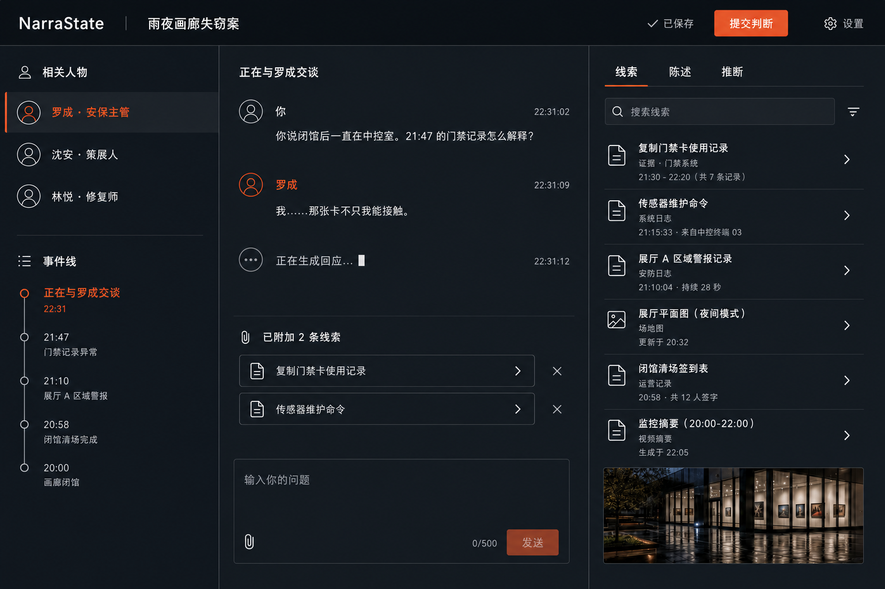

# NarraState

NarraState 是一个状态驱动的 AI 互动叙事运行时。Rust 决定事实、证据影响、角色阶段、披露与结案；LLM 只负责把受约束的行动解释和对话计划渲染成自然语言。

v0.1 提供一个可完整通关的中文侦探审讯 Demo、OpenAI-compatible 模型接入、本地 SQLite 持久化、REST/SSE API，以及 Vue 3 调查工作台。没有模型配置时可直接使用 Mock 模式体验完整状态机。



## 快速开始

需要 Docker Desktop 或 Docker Engine + Compose：

```bash
docker compose up --build
```

打开 <http://127.0.0.1:3000>。数据保存在 Compose volume 中；停止服务使用 `docker compose down`，连同本地数据删除则使用 `docker compose down -v`。

## 从源码运行

需要 stable Rust、Node.js 22 和 npm。Linux/macOS：

```bash
./tools/start-local.sh
```

Windows PowerShell：

```powershell
./tools/start-local.ps1
```

脚本会安装锁定的前端依赖、构建 Web UI，并由 Axum 在 <http://127.0.0.1:3000> 同时托管 API 与前端。也可以分别运行：

```bash
npm --prefix web ci
npm --prefix web run build
cargo run -p narrastate-server -- serve --db data/narrastate.db --cases cases --web web/dist
```

## 模型配置

复制 `.env.example` 中需要的变量到启动环境。密钥可以从 `NARRASTATE_API_KEY` 读取，或由设置页保存到服务端 `data/provider.env`；路径可通过 `NARRASTATE_PROVIDER_ENV_FILE` 修改。不读取通用 `OPENAI_API_KEY`，也不写入 SQLite、浏览器、事件或日志。设置页支持 DeepSeek 等 OpenAI-compatible 服务。

```bash
NARRASTATE_BASE_URL=https://api.openai.com/v1
NARRASTATE_MODEL=gpt-4o-mini
NARRASTATE_API_KEY=your-key
```

Compose 会自动读取仓库根目录的 `.env`。API Key 缺失或为空时，首页显示未配置，Mock 模式仍然可用。

服务端安装的 v0.2 案件包默认写入 `data/installed-cases`，可通过 `NARRASTATE_CASE_INSTALL_DIR` 修改。安装 API 只接受案件内容，不接受客户端提供服务器文件路径。

## 开发命令

```bash
# 全部 Rust 质量门
cargo fmt --all -- --check
cargo clippy --workspace --all-targets -- -D warnings
cargo test --workspace

# 前端质量门
npm --prefix web ci
npm --prefix web run typecheck
npm --prefix web test -- --run
npm --prefix web run build
npm --prefix web run test:e2e

# 案件工具
cargo run -p narrastate-server -- validate-case cases/rain-gallery/case.json
cargo run -p narrastate-server -- generate-schema
cargo run -p narrastate-server -- generate-template-schema
cargo run -p narrastate-server -- generate-manifest-schema
cargo run -p narrastate-server -- generate-generation-schemas
cargo run -p narrastate-server -- case validate cases/rain-gallery-variants --json
cargo run -p narrastate-server -- case generate request.json --output cases/generated
cargo run -p narrastate-server -- case simulate cases/rain-gallery-variants --json
cargo run -p narrastate-server -- case inspect cases/rain-gallery-variants
cargo run -p narrastate-server -- case compile cases/rain-gallery-variants --variant variant-shen
cargo run -p narrastate-server -- case migrate cases/rain-gallery/case.json --output /tmp/rain-gallery-v02
cargo run -p narrastate-server -- game create rain-gallery-variants --variant random --seed 928341 --db data/narrastate.db --cases cases --json
cargo run -p narrastate-server -- play --case rain-gallery --mock
```

## 架构边界

```text
narrastate-core      领域类型、不变量、案件校验
narrastate-runtime   证据评估、状态转换、对话计划、ports
narrastate-provider  OpenAI-compatible provider 与输出防护
narrastate-storage   SQLite、事件、快照、恢复、幂等事务
narrastate-server    Axum API、SSE、DTO 脱敏、组合根
web                  Vue 调查工作台与静态产物
```

核心原则是“Rust 决定发生什么，LLM 决定角色如何表达”。世界真相、角色知识和玩家知识严格分层；`DisclosureGraph` 是完整认罪的唯一通路，不能由矛盾次数或模型文本直接触发。

## 文档

- [实现架构](docs/architecture.md)
- [案件编写指南](docs/case-authoring.md)
- [v0.2 案件格式](docs/case-format.md)
- [AI 案件生成](docs/case-generation.md)
- [非证据性视觉资产](docs/visual-assets.md)
- [真相变体设计](docs/solution-variants.md)
- [确定性校验](docs/validation.md)
- [自动通关模拟](docs/simulation.md)
- [HTTP API](docs/api.md)
- [第三方软件说明](THIRD_PARTY.md)

## 当前范围

当前版本包含确定性的多真相编译、校验、模拟、选择与冻结实例，以及只能生成非权威草案的 AI 案件生成流水线和可选的非证据性视觉资产。

## License

MIT。详见 [LICENSE](LICENSE)。
